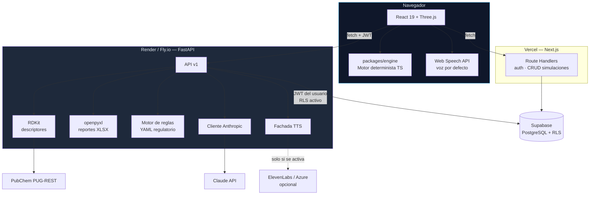

# DERMASENSE-BACKEND

> **Capa científica y documental de DERMASENSE.**
> Servicio Python/FastAPI que resuelve lo que el navegador no puede: química
> computacional con RDKit, ingesta de evidencia desde PubChem, generación de reportes con
> Claude, exportación a Excel, verificación regulatoria y síntesis de voz.

**Repositorio hermano:** [`DERMASENSE`](../DERMASENSE) — frontend Next.js y motor de simulación.

---

## 0. Lo primero: qué NO es este repositorio

**Aquí no vive el motor de simulación, y no debe vivir nunca.**

El motor está en [`packages/engine`](../DERMASENSE/packages/engine) del repositorio frontend:
TypeScript puro, determinista, probado, y **ejecutándose en el navegador** por decisión de
[ADR-001](../DERMASENSE/docs/adr/001-motor-de-simulacion-en-el-cliente.md).

Reimplementarlo en Python con NumPy/SciPy crearía dos fuentes de verdad para el mismo
número. Divergirían —siempre divergen— y una divergencia numérica es exactamente el fallo
más caro posible para un producto cuya propuesta entera es la trazabilidad. Si el motor y
el backend dieran un `log Kp` distinto para la misma cafeína al 2 %, el producto deja de
ser defendible ante un revisor.

| Responsabilidad | Dónde vive | Por qué ahí |
|---|---|---|
| Motor de difusión (Fick + FTCS) | Frontend, navegador | Latencia cero al mover un slider (ADR-001) |
| Potts-Guy, dominio de aplicabilidad | Frontend, navegador | Son tres líneas de aritmética; no justifican una red |
| Auth y sesión | Frontend, Supabase SSR | Ya cableado a cookies HTTP-only |
| CRUD de simulaciones | Frontend, Route Handlers | RLS ya lo protege; moverlo no compra nada |
| **Descriptores moleculares (RDKit)** | **Este repositorio** | Binario C++; no existe equivalente en el navegador |
| **Ingesta y curación PubChem** | **Este repositorio** | Proceso por lotes, no interactivo |
| **Reportes con Claude** | **Este repositorio** | Streaming SSE y control de costo centralizado |
| **Exportación a Excel (7 hojas)** | **Este repositorio** | `openpyxl`; generar XLSX en el cliente es frágil |
| **Reglas regulatorias** | **Este repositorio** | Reglas versionadas como datos auditables |
| **Síntesis de voz** | **Este repositorio** (fachada) | Aísla al frontend del proveedor de TTS |

> **Regla estructural:** si algo se puede calcular en el navegador con los datos que ya
> tiene, no se le pide al backend. Cada llamada de red que añadimos es latencia que el
> usuario paga en el bucle de iteración que define el producto.

---

## 1. Arquitectura



**Dos orígenes, un solo modelo de autorización.** FastAPI no usa `service_role`. Recibe el
JWT del usuario emitido por Supabase Auth, verifica su firma y consulta PostgreSQL **como
ese usuario**, de modo que las políticas RLS de
[ADR-003](../DERMASENSE/docs/adr/003-supabase-rls.md) siguen siendo la última línea de
defensa incluso si un endpoint tuviera un bug de filtrado.

La firma se verifica de las dos formas que emite Supabase: contra
`SUPABASE_JWT_SECRET` si el token viene con HS256, y contra el JWKS público del
proyecto si viene con ES256/RS256 —el modo por defecto en proyectos nuevos—. El
algoritmo del propio token decide cuál se usa.

---

## 2. Estructura del proyecto

```text
DERMASENSE-BACKEND/
├── app/
│   ├── main.py                      # FastAPI, CORS, middleware, lifespan
│   ├── config.py                    # pydantic-settings; falla al arrancar si falta una clave
│   ├── deps.py                      # verificación de JWT, usuario actual, rate limit
│   ├── errors.py                    # formato único de error (TRD §3)
│   │
│   ├── api/v1/
│   │   ├── router.py                # agrega todos los routers bajo /api/v1
│   │   ├── descriptors.py           # SMILES → descriptores moleculares
│   │   ├── ingredients.py           # catálogo con procedencia por campo
│   │   ├── reports.py               # generación de reporte con Claude (SSE)
│   │   ├── voice.py                 # fachada de síntesis de voz
│   │   ├── exports.py               # libro Excel de 7 hojas
│   │   └── regulatory.py            # verificación preliminar por reglas
│   │
│   ├── services/
│   │   ├── rdkit_descriptors.py     # la razón fuerte de que este servicio sea Python
│   │   ├── pubchem.py               # PUG-REST con límite de 5 req/s y caché en disco
│   │   ├── ai.py                    # selecciona proveedor; el contrato que consume reports.py
│   │   ├── claude.py                # cliente Anthropic, streaming, contabilidad de tokens
│   │   ├── openrouter.py            # mismo contrato, transporte OpenAI-compatible
│   │   ├── tts.py                   # Protocol + implementaciones intercambiables
│   │   ├── excel.py                 # openpyxl, una hoja por sección del README §16
│   │   └── regulatory_rules.py      # evaluador de las reglas YAML
│   │
│   ├── prompts/
│   │   └── report_es.py             # prompt literal de docs/AI_PROMPTS.md §2 y §3
│   │
│   ├── schemas/
│   │   ├── simulation.py            # espejo Pydantic de packages/engine/types.ts
│   │   ├── ingredient.py
│   │   └── report.py
│   │
│   ├── rules/
│   │   ├── eu_1223_2009.yaml        # Reglamento (CE) 1223/2009 — anexos II y III
│   │   └── us_mocra.yaml            # MoCRA — substanciación y registros
│   │
│   └── db/
│       └── supabase.py              # cliente por petición, con el JWT del usuario
│
├── ml/                              # ⚠ NUNCA se importa desde app/ en tiempo de ejecución
│   ├── datasets/
│   │   ├── README.md                # columnas y procedencia
│   │   └── huskindb_kp.csv          # 229 compuestos con log Kp medido en piel humana
│   ├── artifacts/
│   │   └── kp_ridge.json            # modelo + métricas; in_production: false
│   ├── notebooks/
│   └── train_kp.py                  # ridge + LOO contra la línea base Potts-Guy
│
├── scripts/
│   ├── build_dataset.py             # HuskinDB → conjunto de entrenamiento
│   ├── curate_ingredients.py        # asistente de curación de los ~60 activos
│   ├── debug_routes.py              # recorre TODAS las rutas y las verifica
│   ├── dev_token.py                 # firma un JWT local para probar con curl
│   └── verify_no_secrets.py         # gancho previo al commit
│
├── tests/
│   ├── conftest.py                  # doble de PostgREST, JWT de prueba, app aislada
│   ├── test_descriptors.py          # RDKit contra valores conocidos de PubChem
│   ├── test_reports.py              # ERROR CRÍTICO: proveedor de IA caído → 503
│   ├── test_regulatory.py           # y: ausencia de regla ≠ aprobación
│   ├── test_exports.py              # las 7 hojas existen y no inventan datos
│   ├── test_ml.py                   # el artefacto no se declara productivo si no gana
│   ├── test_ai_provider.py          # cableado del proveedor y tope de tokens
│   └── test_auth.py                 # 401 sin JWT · 403 con recurso ajeno
│
├── pyproject.toml
├── Dockerfile
├── .env.example
└── README.md
```

Dos reglas que conviene no romper:

- **`ml/` no se importa desde `app/`.** Espeja la regla de `packages/engine`: entrenamiento
  y servicio no se mezclan. Lo que `app/` consume es un artefacto versionado, nunca un
  notebook.
- **Las reglas regulatorias son datos, no código.** El README principal §18 dice *"capa
  basada en reglas y fuentes, no una predicción"*. Si viven en YAML con su cita y su fecha
  de verificación, un formulador puede auditarlas sin leer una línea de Python.

---

## 3. API

Base: `/api/v1`. Formato de error compartido con el frontend
([TRD §3](../DERMASENSE/docs/TRD.md)):

```json
{ "error": { "code": "VALIDATION_ERROR", "message": "...", "details": {} } }
```

| Método | Ruta | Función | Auth |
|---|---|---|---|
| `GET` | `/health` | Sonda de vida y versión | No |
| `POST` | `/descriptors` | SMILES → MW, logP, TPSA, HBD/HBA | Sí |
| `POST` | `/ingredients/resolve` | Nombre → candidatos PubChem con CID | Sí |
| `GET` | `/ingredients` | Catálogo público + privados del usuario | Sí |
| `POST` | `/reports/{simulation_id}` | Reporte técnico con Claude (SSE) | Sí |
| `POST` | `/voice/speech` | Texto → audio | Sí |
| `GET` | `/exports/{simulation_id}.xlsx` | Libro Excel de 7 hojas | Sí |
| `POST` | `/regulatory/check` | Verificación preliminar por reglas | Sí |

### `POST /descriptors`

```jsonc
// request
{ "smiles": "CC(=O)Oc1ccccc1C(=O)O" }

// 200 — cada valor declara su nivel de confianza
{
  "molecular_weight": 180.16,
  "log_p": 1.31,
  "tpsa": 63.6,
  "h_bond_donors": 1,
  "h_bond_acceptors": 4,
  "source": {
    "db": "RDKit",
    "version": "2026.03.1",
    "type": "calculated",
    "level": "estimated"
  }
}
```

El `level` es `estimated`, nunca `verified`. `Crippen.MolLogP` es un logP **calculado**, y
[DATA_SOURCES §3.3](../DERMASENSE/docs/DATA_SOURCES.md) exige que esa diferencia viaje con
el dato hasta la interfaz.

### `POST /reports/{simulation_id}`

Devuelve `text/event-stream`. El streaming no es cosmético: convierte los ~15 s de un
reporte de 1200 tokens en texto que aparece de inmediato, y **es lo que le da a la voz
frases que leer** en lugar de un silencio hasta el bloque completo.

Ante fallo del proveedor devuelve `503 AI_UNAVAILABLE` sin escribir nada en `ai_reports`.
Las métricas de la simulación siguen visibles y guardables: es la propiedad que verifica
`tests/test_reports.py`.

---

## 4. Recursos y stack

| Recurso | Elección | Coste | Por qué esta y no otra |
|---|---|---|---|
| Lenguaje | Python 3.11+ | — | RDKit es el único motivo real; sin él este servicio no existiría |
| Framework | FastAPI + Uvicorn | — | Tipado con Pydantic, SSE nativo, OpenAPI automático |
| Química | **RDKit** (`pip install rdkit`) | Gratis, BSD | Estándar de facto; sin equivalente en JS |
| Datos moleculares | **PubChem PUG-REST** | Gratis, sin clave | CID estable, mantenido por el NIH |
| LLM | **`claude-sonnet-5`** vía Anthropic **o** OpenRouter | $2 / $10 por MTok | Fijado en [TRD §1](../DERMASENSE/docs/TRD.md); `claude-opus-5` ($5/$25) es el salto de calidad si el reporte se ve pobre |
| Voz | **Web Speech API** (navegador) | Gratis | Cero infraestructura, cero clave, cero latencia de red |
| Voz (upgrade) | ElevenLabs o Azure Neural TTS | ~$5/mes o capa gratuita | Solo si la calidad del español lo justifica en el pitch |
| Excel | `openpyxl` | Gratis | Escribe XLSX con estilos sin depender de Office |
| Base de datos | Supabase (PostgreSQL) | Capa gratuita | Ya en uso; RLS es la frontera de seguridad (ADR-003). Se habla con PostgREST vía `httpx`, no con el SDK: ver §10 |
| Alojamiento | **Render** o **Fly.io** | ~$7/mes | Contenedor persistente. **Vercel no sirve**: ver §7 |
| Pruebas | `pytest` + `pytest-asyncio` + `respx` | Gratis | `respx` simula PubChem y Anthropic sin gastar tokens |

### Dependencias

```toml
[project]
requires-python = ">=3.11"
dependencies = [
  "fastapi",
  "uvicorn[standard]",
  "pydantic-settings",
  "python-jose[cryptography]",   # verificación del JWT de Supabase
  "httpx",                       # PubChem
  "rdkit",                       # ~150 MB de wheel binario
  "anthropic",
  "openpyxl",
  "pyyaml",
]

[dependency-groups]
dev = ["pytest", "pytest-asyncio", "respx", "ruff", "mypy"]
```

---

## 5. Machine Learning: el resultado medido

**Hay un modelo entrenado, con datos reales, y no supera a Potts-Guy.**
Eso no es un fracaso: es el hallazgo, y está medido.

### Los datos

[ADR-002](../DERMASENSE/docs/adr/002-modelo-potts-guy.md) descartó el ML porque no
había conjunto de permeabilidad. Ahora lo hay:

> **HuskinDB** — Fröhlich et al. (2020), *Scientific Data* 7:414
> [doi:10.1038/s41597-020-00764-z](https://doi.org/10.1038/s41597-020-00764-z) ·
> datos en [osf.io/26hdm](https://osf.io/26hdm/)

546 mediciones de permeación en **piel humana**, cada una con su referencia y su
DOI. Acceso abierto: un revisor puede descargarlo y rehacer el cálculo.

`scripts/build_dataset.py` lo convierte en el conjunto de entrenamiento. Hace tres
transformaciones, todas explícitas en el código:

1. `log Kp` viene en **cm/s** y Potts-Guy trabaja en **cm/h** → se suma log₁₀(3600).
2. Los descriptores no vienen en el archivo → **RDKit los calcula desde el SMILES**.
   Por eso son `estimated`, nunca `verified`, y el modelo hereda ese nivel.
3. Un compuesto aparece varias veces con condiciones distintas → se agrega por
   mediana, conservando la dispersión.

Resultado: **229 compuestos** dentro del dominio de aplicabilidad (MW ≤ 500,
logP ∈ [-1, 6]).

### El resultado

```
python scripts/build_dataset.py
python ml/train_kp.py
```

| Modelo | MAE | RMSE | R² |
|---|---|---|---|
| Ridge LOO (MW + logP) | 0.900 | 1.199 | 0.212 |
| **Potts-Guy (1992)** | **0.898** | 1.304 | 0.066 |

Añadir TPSA, donores y aceptores lo **empeora** (MAE 0.920): el síntoma clásico
de sobreajuste con pocos datos.

### Por qué el listón es tan alto

El dato que decide todo: **82 compuestos tienen medición repetida, y la dispersión
mediana entre laboratorios es 0,96 unidades de log Kp** para la misma molécula.

Ese es el suelo de error. Un modelo que mejorase 0,05 unidades sobre una
correlación publicada de 1992, en datos que varían 0,96 entre sí, no habría
mejorado nada: habría presentado ruido con mejor formato. Por eso `train_kp.py`
exige batir la línea base **por encima del ruido experimental** antes de declarar
nada, y por eso el artefacto sale marcado `in_production: false`.

El motor sigue con Potts-Guy, ahora por una razón medida en lugar de por ausencia
de datos.

### Las tres capas que se confunden

| Capa | Herramienta | Naturaleza | Nivel del dato |
|---|---|---|---|
| Descriptores desde estructura | RDKit | Librería local, no API | ⚠️ Estimado — logP calculado |
| Datos experimentales | PubChem · HuskinDB | API pública · dataset citable | ✅ Verificado *si* la medida es experimental |
| Predicción de permeabilidad | Potts-Guy | Aritmética | ✅ Publicada y citable |

**El matiz que decide la credibilidad del catálogo:** PubChem devuelve casi siempre
`XLogP3`, que es calculado por computadora, no medido. Un error de 0.5 unidades en
logP desplaza `log Kp` en 0.35, un factor de más de 2 en permeabilidad. Por eso
[DATA_SOURCES §3.2](../DERMASENSE/docs/DATA_SOURCES.md) decidió **curación manual**
de unos 60 activos en lugar de importación automática.

---

## 6. Voz

**La API de Claude no ofrece texto-a-voz.** Hay que elegir proveedor, y el README principal
§20 dejó la casilla en blanco.

| Opción | Coste | Latencia | Español | Veredicto |
|---|---|---|---|---|
| **Web Speech API** (`speechSynthesis`) | $0 | 0 ms, local | Variable según el sistema | **Por defecto** — sin clave, sin red, sin infraestructura |
| ElevenLabs | ~$5/mes | 300-800 ms | Excelente | Mejora si el pitch lo exige |
| Azure Neural TTS | Capa gratuita | 200-500 ms | Muy bueno | Alternativa sólida |

El navegador gana el arranque sin discusión: no hay clave que filtrar, no hay salto de red
y funciona sin conexión igual que el motor. `POST /voice/speech` existe como **fachada**,
para poder cambiar de proveedor sin tocar una línea del frontend.

```python
# app/services/tts.py — el contrato, no la implementación
class SpeechSynthesizer(Protocol):
    async def synthesize(self, text: str, voice: str = "es-ES") -> bytes: ...
```

**La restricción que no se negocia** ([AGENTS.md](../DERMASENSE/AGENTS.md) regla 3): la voz
lee el texto que Claude interpretó, y Claude solo recibe números que produjo el motor. El
TTS **nunca genera contenido**; solo pronuncia el que ya fue calculado y verificado.

---

## 7. Despliegue

**Vercel no sirve para este servicio.** El wheel de RDKit pesa unos 150 MB y rebasa el
límite de tamaño de función; en Lambda el arranque en frío lo vuelve inusable dentro de un
flujo interactivo.

| Plataforma | Veredicto |
|---|---|
| **Render** (Starter, ~$7/mes) | **Recomendado.** Contenedor persistente, despliegue desde Git |
| **Fly.io** | Equivalente; mejor si se busca cercanía geográfica |
| Render (capa gratuita) | Sirve para demostrar, pero se suspende a los 15 min de inactividad: el primer usuario tras la pausa espera ~50 s |
| Vercel / Lambda | **Descartado** por tamaño de RDKit y arranque en frío |

**Vía de escape si el despliegue se atasca:** sacar RDKit del camino de petición.
`scripts/curate_ingredients.py` precomputa los descriptores de los ~60 activos y el
servicio pasa a servir una tabla estática. El resto de la API —reportes, Excel,
regulatorio, voz— no depende de RDKit y despliega en cualquier sitio.

---

## 8. Setup local

```bash
git clone https://github.com/<org>/dermasense-backend.git
cd dermasense-backend

python -m venv .venv
source .venv/bin/activate          # Windows: .venv\Scripts\activate

pip install -e ".[dev]"

cp .env.example .env               # completar las claves
uvicorn app.main:app --reload      # http://localhost:8000/docs
```

Pruebas y calidad:

```bash
pytest                                   # 63 pruebas, sin red ni tokens gastados
pytest -k reports -v                     # solo el comportamiento ante fallo de IA
ruff check . && mypy app
python scripts/verify_no_secrets.py      # ninguna credencial versionada
```

**Recorrido de todas las rutas, con IA real.** `scripts/debug_routes.py` ejercita
cada endpoint —RDKit, PubChem, reglas, Excel, JWT y el proveedor de IA de
verdad— y sustituye únicamente PostgreSQL:

```bash
python scripts/debug_routes.py            # 34 comprobaciones, gasta ~$0,015
python scripts/debug_routes.py --no-ai    # sin llamar al modelo
```

Además de los códigos de estado comprueba el **contenido** del reporte: que
respete la estructura del prompt, que etiquete la irritación como heurística, que
no se trunque, y que no aparezca ninguna frase que sobredeclare seguridad.

**Modelo de permeabilidad:**

```bash
python scripts/build_dataset.py           # HuskinDB → 229 compuestos
python ml/train_kp.py                     # ridge + LOO contra Potts-Guy
```

Para probar la API a mano hace falta un JWT. `scripts/dev_token.py` firma uno con
el `SUPABASE_JWT_SECRET` local —no sirve contra el Supabase real, y esa es la
idea—:

```bash
uvicorn app.main:app --reload
TOKEN=$(python scripts/dev_token.py)
curl -s localhost:8000/health
curl -s -X POST localhost:8000/api/v1/descriptors      -H "Authorization: Bearer $TOKEN" -H "Content-Type: application/json"      -d '{"smiles": "CC(=O)Oc1ccccc1C(=O)O"}'
```

Si el proyecto firma con claves asimétricas no hay secreto que compartir: el token
sale de la sesión real del frontend (`supabase.auth.getSession()`).

### Variables de entorno

| Variable | Ámbito | Descripción |
|---|---|---|
| `SUPABASE_URL` | servidor | URL del proyecto Supabase |
| `SUPABASE_ANON_KEY` | servidor | Clave anónima; las consultas viajan con el JWT del usuario |
| `SUPABASE_JWT_SECRET` | **secreto** | Verificación de firma HS256. Vacío en proyectos con claves asimétricas |
| `SUPABASE_JWKS_URL` | servidor | Solo si el JWKS no está en la ruta estándar del proyecto |
| `AI_PROVIDER` | servidor | `anthropic` (por defecto) · `openrouter` |
| `ANTHROPIC_API_KEY` | **secreto** | Clave de la API de Claude |
| `ANTHROPIC_MODEL` | servidor | Por defecto `claude-sonnet-5` |
| `OPENROUTER_API_KEY` | **secreto** | Alternativa; sirve el mismo modelo a la misma tarifa |
| `AI_MAX_TOKENS` | servidor | Por defecto 2000. Con 1200 el reporte sale cortado |
| `TTS_PROVIDER` | servidor | `browser` (por defecto) · `elevenlabs` · `azure` |
| `TTS_API_KEY` | **secreto** | Solo si `TTS_PROVIDER` no es `browser` |
| `CORS_ORIGINS` | servidor | Dominios del frontend, separados por coma |

> `SUPABASE_SERVICE_ROLE_KEY` **no aparece en esta lista y no debe usarse aquí.** Omite RLS
> y queda reservada a migraciones y seed, que viven en el repositorio frontend.

---

## 9. Reglas no negociables

Heredadas de [AGENTS.md](../DERMASENSE/AGENTS.md) y vigentes aquí sin cambios:

1. **Ninguna credencial en el repositorio.** Ni en código, ni en documentación, ni en
   commits. Solo `.env.example` con marcadores de posición.
2. **El motor de simulación no se reimplementa en Python.** Este servicio no calcula
   penetración dérmica.
3. **La IA no calcula números.** Todo valor numérico proviene del motor; Claude solo
   interpreta y la voz solo pronuncia.
4. **No se sobredeclara la capacidad del modelo.** Nunca "valida", "garantiza" ni "asegura"
   la seguridad de una formulación. Se estima, bajo supuestos declarados.
5. **El índice de irritación es heurístico** y se etiqueta así en toda respuesta de la API.
6. **Cada dato viaja con su procedencia y su nivel.** Un valor sin fuente no sale de este
   servicio sin la etiqueta que lo advierta.

Antes de dar por terminada una tarea:

```bash
pytest                                              # en verde
git grep -iE "sk-ant|service_role|eyJhbGci"         # sin resultados
```

---

## 10. Estado

Servicio implementado, con la suite en verde. Lo que falta es dato, no código.

| Bloque | Estado |
|---|---|
| Scaffold FastAPI, config, verificación de JWT | **Hecho** — firma simétrica y asimétrica |
| `POST /descriptors` con RDKit | **Hecho** — 180.16 / 1.31 / 63.6 para aspirina |
| `POST /ingredients/resolve` con PubChem | **Hecho** — 5 req/s y caché en disco |
| `POST /reports/{id}` con Claude y SSE | **Hecho** — 503 sin escritura ante fallo |
| `GET /exports/{id}.xlsx` | **Hecho** — 7 hojas más portada |
| `POST /regulatory/check` | **Hecho** — 1223/2009 y MoCRA en YAML |
| Fachada de voz | **Hecho** — navegador por defecto; ElevenLabs y Azure tras el `Protocol` |
| Reportes con IA real | **Verificado** — OpenRouter · `anthropic/claude-sonnet-5` |
| Modelo de ML | **Entrenado y medido** — no supera a Potts-Guy (§5) |
| Pruebas | **63 en verde** (`pytest`) · **34/34** rutas (`debug_routes.py`) · `ruff` limpio |
| Proyecto Supabase real y migraciones | Pendiente — bloquea todo lo que toca la base de datos |
| Curación de los ~60 activos | Pendiente — `scripts/curate_ingredients.py` ya asiste el proceso |
| Prueba de aislamiento entre dos usuarios | Pendiente — requiere Supabase real |

### Tres desviaciones respecto al diseño original

1. **PostgREST por `httpx` en lugar del SDK `supabase`.** El SDK está pensado
   para un cliente de larga vida con sesión propia; aquí hace falta lo
   contrario: un cliente efímero que porta el JWT de *esta* petición y muere con
   ella. Un singleton compartido haría que `auth.uid()` dejara de corresponder al
   solicitante, y esa es exactamente la puerta por la que se cuela
   `service_role`.

2. **Verificación de JWT con dos modos.** Los proyectos nuevos de Supabase firman
   con claves asimétricas (ES256/RS256) y no exponen `SUPABASE_JWT_SECRET`. El
   servicio lee el algoritmo del token y verifica contra el secreto o contra el
   JWKS del proyecto, sin que el resto del código se entere de cuál toca.

3. **Proveedor de IA intercambiable.** `AI_PROVIDER` elige entre Anthropic
   directo y OpenRouter. El modelo es el mismo (`claude-sonnet-5`) y la tarifa
   también; solo cambia el transporte, así que TRD §1 sigue siendo cierto.

4. **`AI_MAX_TOKENS` sube de 1200 a 2000.** Medido: el reporte en español ocupa
   ~1360 tokens y con el tope de `docs/AI_PROMPTS.md` salía cortado a mitad de
   frase, sin error de por medio. El evento `done` ahora incluye `truncated`.

5. **El ML dejó de ser roadmap.** Hay dataset citable (HuskinDB), entrenamiento
   con validación leave-one-out y un veredicto medido. Ver §5.

6. **Un código de error nuevo: `DEPENDENCY_UNAVAILABLE` (503).** Cuando falta
   RDKit, o cuando el TTS delega en el navegador, reutilizar `AI_UNAVAILABLE`
   mentiría sobre la causa. Los códigos del [TRD §3](../DERMASENSE/docs/TRD.md)
   siguen siendo válidos; este se suma.

### El siguiente paso real

Todo lo que toca la base de datos —reportes, exportación, catálogo— está escrito
pero **nunca se ha ejecutado contra un Supabase real**: las pruebas usan un doble
de PostgREST, que verifica el comportamiento del servicio pero no las políticas
RLS. Crear el proyecto y correr las migraciones de
[`BACKEND_SCHEMA.md`](../DERMASENSE/docs/BACKEND_SCHEMA.md) es lo que convierte
esto en un servicio verificado de extremo a extremo, en el orden que fija
[`conexion.md`](conexion.md) §7.

---

## Licencia

MIT
